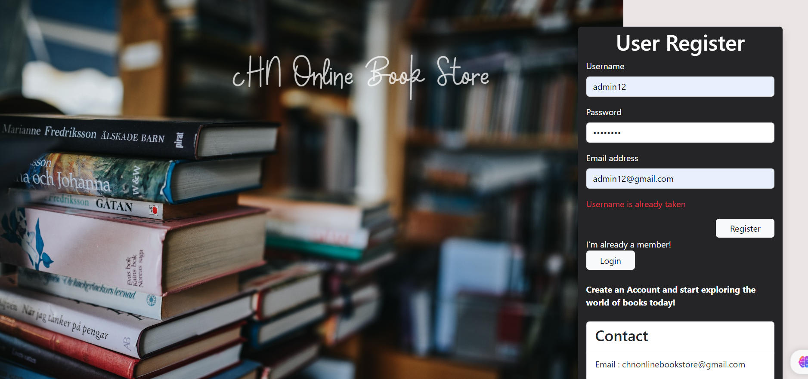
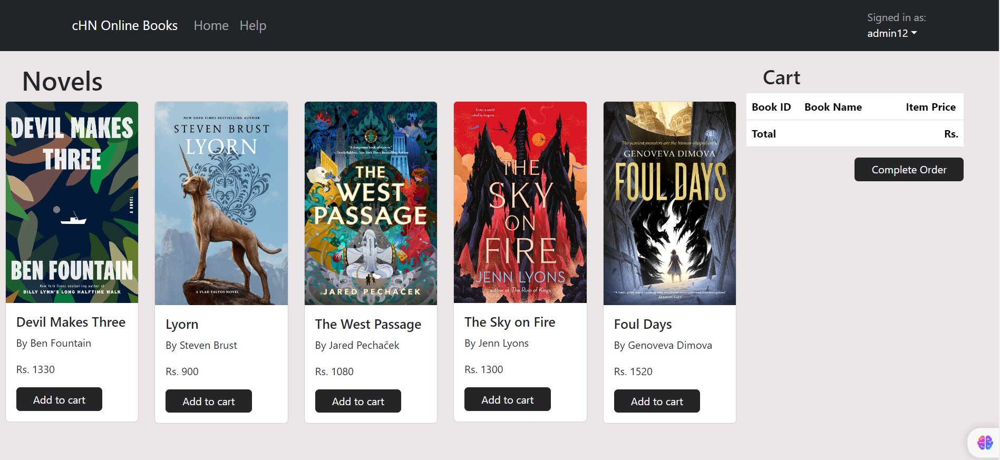
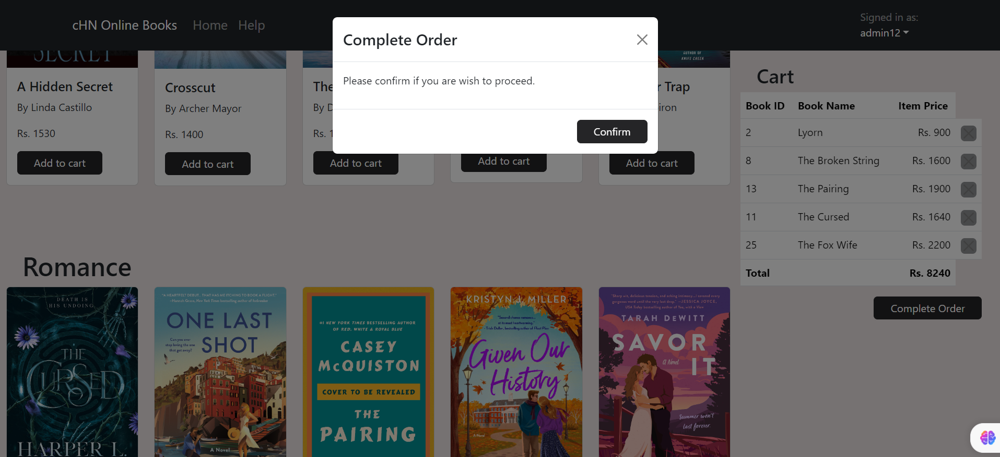
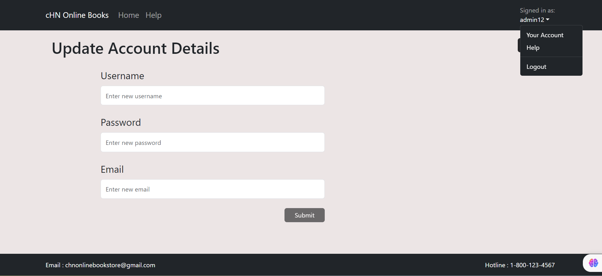

# Online Bookstore Application

A web-based platform that provides a better interface for registering and logging users, allows users to filter books by category, and a shopping cart facility where users can view the books and prices of the books they have added.Also user can change their account details.

## Screenshots

*Caption for Screenshot 1*

*Caption for Screenshot 1*

*Caption for Screenshot 1*

*Caption for Screenshot 1*

## Installation

Before setting up the project, ensure you have the following prerequisites installed on your system:
- Java 17
- Maven
- MySQL Database
- Node.js and npm (for React)

### Setting Up the Backend
1. **Clone the project repository.**
2. **Navigate to the backend directory.**
3. **Open the `src/main/resources/application.properties` file and update the MySQL server URL, username, and password to match your database configuration.**
4. **Build and run the backend using Maven.**

   The backend should be running on the specified port (usually 9000).

### Setting Up the Frontend
1. **Open a new terminal window.**
2. **Navigate to the frontend directory.**
3. **Install the required frontend dependencies using npm.**
4. **Start the frontend development server.**

   The frontend should be running on a development server, usually on port 3000.

### Accessing the Online Book Store
1. **Open your web browser.**
2. **Visit (http://localhost:3000) in your browser to access the Online Book Store.**
3. **You can create a new account on the registration page and then log in to start using the site.**

    Sometimes when zipping the front-end file `node_modules` can be removed. If so, please install the Node package.

## Frontend Stack

- ReactJS: The frontend is developed using ReactJS, providing a responsive and interactive user interface.
- React Bootstrap: I use React Bootstrap components for UI elements.
- SCSS: For styling and theming the application.

## Backend Stack

- Java 17: The backend is developed using Java 17, providing the core functionality of the application.
- pring Boot: I have used Spring Boot to simplify the development of the backend and handle various aspects of the application, such as routing and data access.
- Maven: I use Maven as a build tool to manage dependencies and build the project.
- JPA (Java Persistence API): JPA is used for database interaction and management.
- MySQL Database: The application uses a MySQL database to store book and user information.

    __________Enjoy using my Online Book Store!_____________
